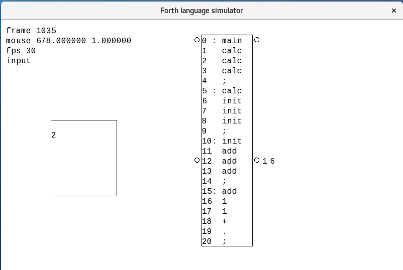

# Forth-language-simulator
Two stack pushdown automaton animated with SFML. The Forth language is executed in singlestep mode. Only a few commands of Forth are implemented.

tutorial:
1. compile: g++ -std=c++14 -lsfml-graphics -lsfml-window -lsfml-system -pthread fls.cpp
2. [up] [down] = move instruction pointer
3. [left] = switch to next cpu
4. [right] execute command
5. "run" activates macro for running both cpu

